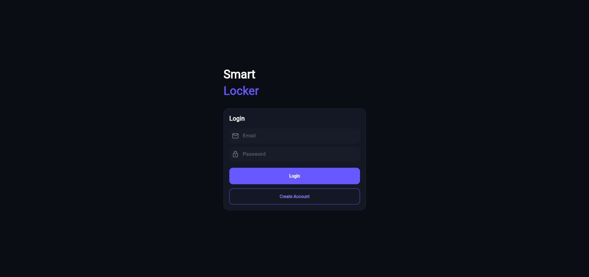
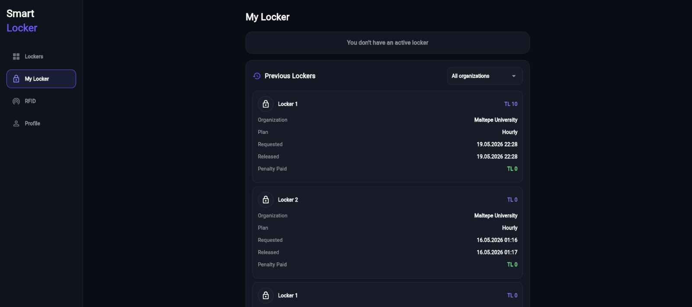
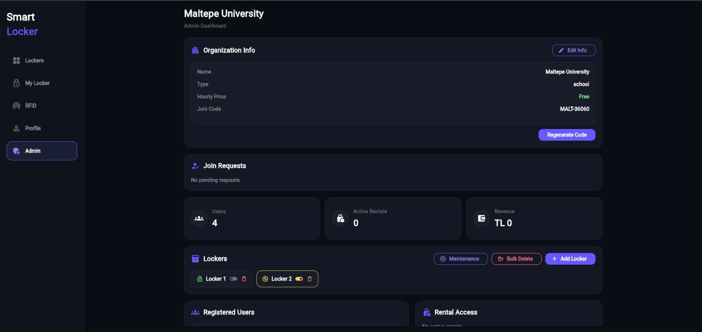
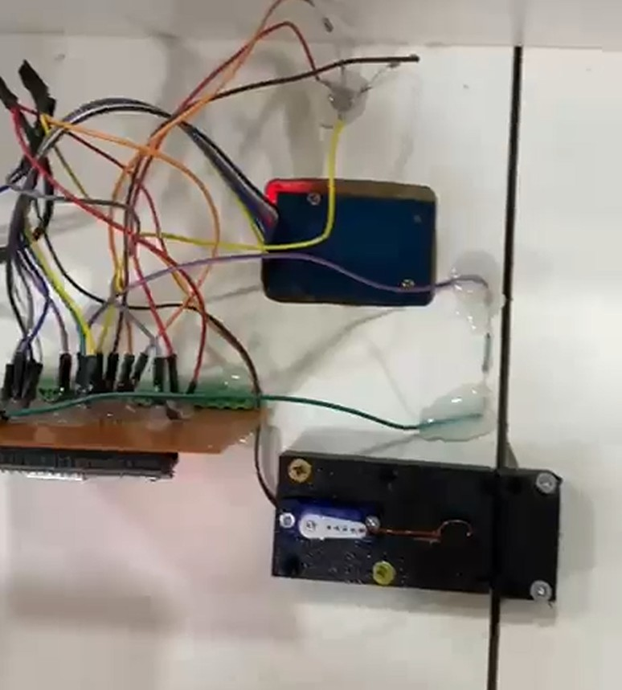

# Smart Locker System

An IoT-based smart locker system developed as a university project using Flutter, Firebase and ESP32.

The goal of this project is to allow users to rent lockers through a web application and access them securely using RFID cards. The system combines cloud services, embedded systems and a modern web interface to provide real-time locker management.

---

## Features

- RFID card authentication
- Real-time Firebase integration
- ESP32-based locker controller
- Servo motor locking mechanism
- RGB LED status indicators
- Reed switch door monitoring
- Organization-based management system
- User and admin dashboards
- Real-time locker status tracking

---

## Technologies Used

### Software

- Flutter Web
- Dart
- Firebase Authentication
- Firebase Realtime Database

### Hardware

- ESP32
- RC522 RFID Reader
- SG90 Servo Motor
- RGB LED
- Reed Switch
- 5V Power Supply

### Design & Simulation Tools

- Wokwi
- Blender
- Tinkercad

---

## System Architecture

```text
RFID Card
    ↓
RC522 RFID Reader
    ↓
ESP32
    ↓
Firebase Realtime Database
    ↓
Flutter Web Application
    ↓
Admin / User
```

---

## How It Works

1. A user rents a locker through the web application.
2. The locker is assigned to the user in Firebase.
3. An RFID card is associated with the user account.
4. When the card is scanned, ESP32 checks authorization data from Firebase.
5. If access is granted, the servo motor unlocks the locker.
6. The locker status is updated in real time.
7. All actions are logged in Firebase.

---

## Project Structure

```text
smart_locker_system/
│
├── lib/                # Flutter source code
├── web/                # Web configuration
├── esp32/              # ESP32 firmware
├── screenshots/        # Project screenshots
├── README.md
└── pubspec.yaml
```

---

## Screenshots

### Login Screen



### Locker Dashboard



### Admin Panel



### Hardware Prototype



---

## My Contributions

- Developed the Flutter-based web application
- Implemented Firebase Authentication and Realtime Database integration
- Developed ESP32 firmware for locker control and cloud communication
- Implemented RFID-based user authentication
- Designed and simulated the electronic circuit using Wokwi
- Designed the locker enclosure and mechanical structure using Blender
- Designed custom screws and mounting components for the locking mechanism using Tinkercad
- Implemented real-time locker status monitoring and management

---

## Installation and Setup

### 1. Clone the Repository

```bash
git clone https://github.com/meehhmett/smart_locker_system.git
cd smart_locker_system
```

### 2. Install Flutter Dependencies

```bash
flutter pub get
```

### 3. Configure Firebase

Create your own Firebase project and configure:

- Firebase Authentication
- Firebase Realtime Database
- `firebase_options.dart`

If Firebase configuration values are replaced with placeholders, update them with your own Firebase project information.

### 4. Run the Web Application

```bash
flutter run -d chrome
```

or

```bash
flutter run -d web-server --web-hostname 0.0.0.0 --web-port 8080
```

---

## ESP32 Setup

ESP32 firmware is located in the `esp32/` folder.

Before uploading the code, update the Wi-Fi credentials:

```cpp
#define WIFI_SSID "YOUR_WIFI"
#define WIFI_PASSWORD "YOUR_PASSWORD"
```

Also configure Firebase database information if needed.

Upload the firmware to the ESP32 using PlatformIO or Arduino IDE.

---

## Hardware Components

- ESP32
- RC522 RFID Reader
- SG90 Servo Motor
- RGB LED
- Reed Switch
- 5V Power Supply
- Jumper wires
- Locker prototype

---

## Future Improvements

- NFC support
- QR code access
- Mobile application
- Online payment integration
- Multi-locker support
- Reservation system
- Improved security and access logs

---

# Türkçe

## Smart Locker System

Smart Locker, Flutter, Firebase ve ESP32 kullanılarak geliştirilmiş IoT tabanlı bir akıllı dolap sistemidir.

Bu projede amaç, kullanıcıların web uygulaması üzerinden dolap kiralayabilmesi ve kiraladıkları dolaba RFID kart ile güvenli şekilde erişebilmesidir. Sistem; bulut servisleri, gömülü sistemler ve modern bir web arayüzünü bir araya getirerek gerçek zamanlı dolap yönetimi sağlar.

---

## Özellikler

- RFID kart ile kullanıcı doğrulama
- Firebase ile gerçek zamanlı veri senkronizasyonu
- ESP32 tabanlı dolap kontrol sistemi
- Servo motor ile kilitleme mekanizması
- RGB LED durum göstergeleri
- Reed switch ile kapı durumu takibi
- Organizasyon bazlı yönetim sistemi
- Kullanıcı ve admin panelleri
- Gerçek zamanlı dolap durumu izleme

---

## Kullanılan Teknolojiler

### Yazılım

- Flutter Web
- Dart
- Firebase Authentication
- Firebase Realtime Database

### Donanım

- ESP32
- RC522 RFID Okuyucu
- SG90 Servo Motor
- RGB LED
- Reed Switch
- 5V Adaptör

### Tasarım ve Simülasyon Araçları

- Wokwi
- Blender
- Tinkercad

---

## Sistem Mimarisi

```text
RFID Kart
    ↓
RC522 RFID Okuyucu
    ↓
ESP32
    ↓
Firebase Realtime Database
    ↓
Flutter Web Uygulaması
    ↓
Admin / Kullanıcı
```

---

## Sistem Nasıl Çalışır

1. Kullanıcı web uygulaması üzerinden dolap kiralar.
2. Kiralanan dolap Firebase üzerinde kullanıcıya atanır.
3. RFID kart kullanıcı hesabı ile eşleştirilir.
4. Kart okutulduğunda ESP32, Firebase üzerinden yetki kontrolü yapar.
5. Yetkili kart okutulursa servo motor kilidi açar.
6. Dolap durumu gerçek zamanlı olarak güncellenir.
7. İşlem kayıtları Firebase üzerinde tutulur.

---

## Proje Yapısı

```text
smart_locker_system/
│
├── lib/                # Flutter kaynak kodları
├── web/                # Web yapılandırması
├── esp32/              # ESP32 firmware kodları
├── screenshots/        # Proje ekran görüntüleri
├── README.md
└── pubspec.yaml
```

---

## Ekran Görüntüleri

### Giriş Ekranı


### Dolap Paneli


### Admin Paneli


### Donanım Prototipi


---

## Projedeki Katkılarım

- Flutter tabanlı web uygulamasının geliştirilmesi
- Firebase Authentication ve Realtime Database entegrasyonu
- ESP32 firmware geliştirme
- RFID tabanlı kullanıcı doğrulama sistemi
- Wokwi kullanılarak elektronik devre tasarımı ve simülasyonu
- Blender kullanılarak dolap gövdesi ve mekanik yapı tasarımı
- Tinkercad kullanılarak kilit mekanizmasına ait özel vida ve bağlantı parçalarının tasarımı
- Gerçek zamanlı dolap durumu izleme ve yönetim sistemi

---

## Kurulum ve Çalıştırma

### 1. Repoyu Klonlayın

```bash
git clone https://github.com/meehhmett/smart_locker_system.git
cd smart_locker_system
```

### 2. Flutter Bağımlılıklarını Kurun

```bash
flutter pub get
```

### 3. Firebase Yapılandırması

Kendi Firebase projenizi oluşturup gerekli ayarları yapın:

- Firebase Authentication
- Firebase Realtime Database
- `firebase_options.dart`

Eğer Firebase bilgileri örnek değerlerle değiştirildiyse, kendi Firebase proje bilgilerinizi eklemeniz gerekir.

### 4. Web Uygulamasını Çalıştırın

```bash
flutter run -d chrome
```

veya

```bash
flutter run -d web-server --web-hostname 0.0.0.0 --web-port 8080
```

---

## ESP32 Kurulumu

ESP32 kodları `esp32/` klasöründe yer almaktadır.

Kodu yüklemeden önce Wi-Fi bilgilerini güncelleyin:

```cpp
#define WIFI_SSID "YOUR_WIFI"
#define WIFI_PASSWORD "YOUR_PASSWORD"
```

Gerekirse Firebase veritabanı bilgilerini de kendi projenize göre düzenleyin.

Ardından kodu ESP32 kartına PlatformIO veya Arduino IDE kullanarak yükleyin.

---

## Gerekli Donanımlar

- ESP32
- RC522 RFID Okuyucu
- SG90 Servo Motor
- RGB LED
- Reed Switch
- 5V Adaptör
- Jumper kablolar
- Dolap prototipi

---


## Note

This project was developed for educational purposes as a university project.
